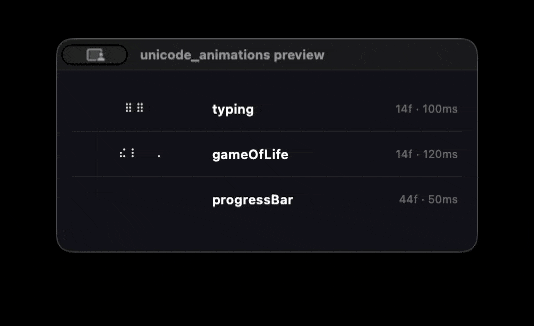
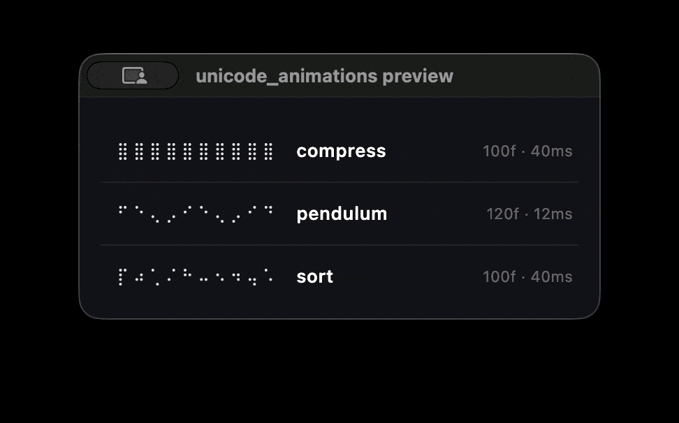

## 1.2.0

### New spinners

3 new procedural generators:

- `typing` — cursor typing effect (14 frames, 3 chars)
- `gameOfLife` — Conway's Game of Life simulation (14 frames, 4 chars)
- `progressBar` — horizontal fill-and-drain progress bar (44 frames, 10 chars)

## 1.1.0

### New spinners

3 new procedural generators ported from [esceptico's CodePen](https://codepen.io/esceptico/pen/LEZaJPa):

- `pendulum` — swinging pendulum wave (120 frames, 10 chars)
- `compress` — data compression visualization (100 frames, 10 chars)
- `sort` — sorting visualization with sweep cursor (100 frames, 10 chars)

### New public API

- `brailleBase` — Braille character base codepoint (`U+2800`)
- `dotBits` — dot bit map for direct Braille bit manipulation

## 1.0.1

- Added `example/example.dart` so the package example is detected by pub.dev (Improve pub.dev score)
- Updated demo.gif to better preview available animations.

## 1.0.0

**Initial release** — pure Dart port of the [unicode-animations](https://github.com/gunnargray-dev/unicode-animations) TypeScript library.

### Features

- `Spinner` class with `frames` (`List<String>`) and `intervalInMs` (`int` ms)
- `BrailleSpinnerName` enum for all 18 available spinners
- `Spinner.of(BrailleSpinnerName)` — non-nullable lookup shortcut
- `spinners` — pre-computed, unmodifiable `Map<BrailleSpinnerName, Spinner>`
- All 15 procedural generators accept an optional `intervalInMs` parameter for custom timing
- `makeGrid` / `gridToBraille` helpers for building custom Braille animations
- Zero dependencies (pure Dart, SDK ^3.3.0)

### Spinners included

3 hardcoded spinners:

- `braille` — classic Braille dot cycle
- `brailleWave` — rolling wave across the dot grid
- `dna` — double-helix Braille pattern

15 procedural generators:

- `scan` — vertical bar sweeping left-to-right
- `scanLine` — full-row horizontal scan
- `pulse` — radial pulse expanding from center
- `breathe` — smooth breathing rhythm
- `orbit` — dot orbiting the perimeter
- `rain` — dots falling downward
- `snake` — winding snake path
- `helix` — interleaved helix strands
- `cascade` — cascading column fills
- `columns` — independent column animations
- `waveRows` — sine-wave row animation
- `fillSweep` — diagonal fill-and-clear sweep
- `diagSwipe` — diagonal wipe transition
- `checkerboard` — alternating checkerboard pattern
- `sparkle` — random twinkling dots
