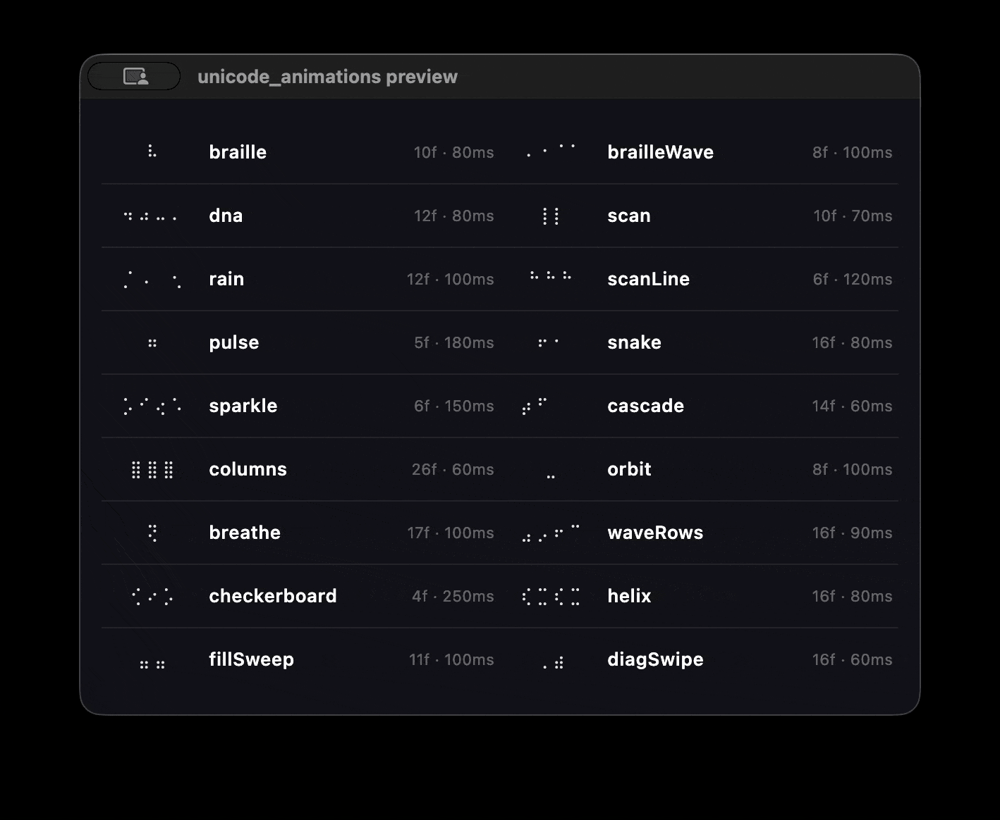

# unicode_animations

[](https://dart.dev)
[](https://pub.dev/packages/unicode_animations)
[](LICENSE)

Unicode spinner animations as raw frame data — no dependencies, works everywhere.

A pure Dart port of [`unicode-animations`](https://github.com/gunnargray-dev/unicode-animations).

## Demo



See all 18 spinners in the terminal:

```bash
# Cycle through all spinners
dart run tools/verify_all.dart

# Animate a specific spinner (5 seconds)
dart run example/demo.dart
dart run example/demo.dart helix
dart run example/demo.dart brailleWave
```

## Install

Add to your `pubspec.yaml`:

```yaml
dependencies:
  unicode_animations: ^1.0.0
```

```bash
dart pub get
# or in a Flutter project:
flutter pub get
```

## Quick start

```dart
import 'package:unicode_animations/unicode_animations.dart';

final spinner = Spinner.of(BrailleSpinnerName.braille);
// spinner.frames → List<String> (e.g. ['⠋', '⠙', '⠹', ...])
// spinner.intervalInMs → int (milliseconds between frames, e.g. 80)
```

## Examples

### CLI tool — spinner during async work

```dart
import 'dart:async';
import 'dart:io';
import 'package:unicode_animations/unicode_animations.dart';

Future<T> runWithSpinner<T>(
  String label,
  Future<T> Function() fn, {
  BrailleSpinnerName name = BrailleSpinnerName.braille,
}) async {
  final spinner = Spinner.of(name);
  int i = 0;
  final timer = Timer.periodic(Duration(milliseconds: spinner.intervalInMs), (_) {
    stdout.write('\r\x1B[2K  ${spinner.frames[i++ % spinner.frames.length]} $label');
  });
  final result = await fn();
  timer.cancel();
  stdout.write('\r\x1B[2K  ✔ $label\n');
  return result;
}

Future<void> main() async {
  await runWithSpinner('Linting...', lint, name: BrailleSpinnerName.scan);
  await runWithSpinner('Running tests...', test, name: BrailleSpinnerName.helix);
  await runWithSpinner('Building...', build, name: BrailleSpinnerName.cascade);
  await runWithSpinner('Publishing...', publish, name: BrailleSpinnerName.braille);
}
```

### Reusable spinner helper

```dart
import 'dart:async';
import 'dart:io';
import 'package:unicode_animations/unicode_animations.dart';

class CliSpinner {
  CliSpinner(BrailleSpinnerName name) : _spinner = Spinner.of(name);

  final Spinner _spinner;
  Timer? _timer;
  int _i = 0;

  void start(String message) {
    _timer = Timer.periodic(Duration(milliseconds: _spinner.intervalInMs), (_) {
      final frame = _spinner.frames[_i++ % _spinner.frames.length];
      stdout.write('\r\x1B[2K  $frame $message');
    });
  }

  void stop(String message) {
    _timer?.cancel();
    stdout.write('\r\x1B[2K  ✔ $message\n');
  }
}

Future<void> main() async {
  final s = CliSpinner(BrailleSpinnerName.dots);
  s.start('Connecting to database...');
  await Future<void>.delayed(const Duration(seconds: 2));
  s.stop('Database ready.');
}
```

### Flutter widget

Frames are plain data — consume them directly with a `Timer`:

```dart
import 'dart:async';
import 'package:flutter/material.dart';
import 'package:unicode_animations/unicode_animations.dart';

class SpinnerText extends StatefulWidget {
  const SpinnerText({super.key, this.name = BrailleSpinnerName.helix});
  final BrailleSpinnerName name;

  @override
  State<SpinnerText> createState() => _SpinnerTextState();
}

class _SpinnerTextState extends State<SpinnerText> {
  late final Spinner _spinner = Spinner.of(widget.name);
  late final Timer _timer;
  int _frame = 0;

  @override
  void initState() {
    super.initState();
    _timer = Timer.periodic(
      Duration(milliseconds: _spinner.intervalInMs),
      (_) => setState(() => _frame++),
    );
  }

  @override
  void dispose() {
    _timer.cancel();
    super.dispose();
  }

  @override
  Widget build(BuildContext context) {
    return Text(
      _spinner.frames[_frame % _spinner.frames.length],
    );
  }
}
```

## All spinners

### Classic Braille

| Name          | Preview               | intervalInMs |
| ------------- | --------------------- | ------------ |
| `braille`     | `⠋ ⠙ ⠹ ⠸ ⠼ ⠴ ⠦ ⠧ ⠇ ⠏` | 80ms         |
| `brailleWave` | `⠁⠂⠄⡀` → `⠂⠄⡀⢀`       | 100ms        |
| `dna`         | `⠋⠉⠙⠚` → `⠉⠙⠚⠒`       | 80ms         |

### Grid animations (Braille)

| Name           | Frames | intervalInMs |
| -------------- | ------ | ------------ |
| `scan`         | 10     | 70ms         |
| `rain`         | 12     | 100ms        |
| `scanLine`     | 6      | 120ms        |
| `pulse`        | 5      | 180ms        |
| `snake`        | 16     | 80ms         |
| `sparkle`      | 6      | 150ms        |
| `cascade`      | 14     | 60ms         |
| `columns`      | 26     | 60ms         |
| `orbit`        | 8      | 100ms        |
| `breathe`      | 17     | 100ms        |
| `waveRows`     | 16     | 90ms         |
| `checkerboard` | 4      | 250ms        |
| `helix`        | 16     | 80ms         |
| `fillSweep`    | 11     | 100ms        |
| `diagSwipe`    | 16     | 60ms         |

## Custom spinners

Build your own Braille animations using the grid utilities:

```dart
final bouncingDot = Spinner(
  frames: List<String>.generate(4, (row) {
    final grid = makeGrid(4, 2);
    grid[row][0] = true;
    return gridToBraille(grid);
  }),
  intervalInMs: 150,
);
```

You can also use emoji frames directly — no Braille required:

```dart
const clock = Spinner(
  frames: ['🕛', '🕐', '🕑', '🕒', '🕓', '🕔', '🕕', '🕖', '🕗', '🕘', '🕙', '🕚'],
  intervalInMs: 100,
);
```

See [example/custom_spinner.dart](example/custom_spinner.dart) for the complete runnable example.

You can also override the intervalInMs of any built-in generator:

```dart
final fastHelix = generateHelix(intervalInMs: 40); // default is 80ms
```

## API

### `class Spinner`

```dart
class Spinner {
  const Spinner({
    required this.frames,
    required this.intervalInMs,
  });

  /// The animation frames as Unicode strings.
  final List<String> frames;

  /// The interval between frames in milliseconds.
  final int intervalInMs;
```

### `enum BrailleSpinnerName`

```dart
enum BrailleSpinnerName {
  braille,
  brailleWave,
  dna,
  scan,
  rain,
  scanLine,
  pulse,
  snake,
  sparkle,
  cascade,
  columns,
  orbit,
  breathe,
  waveRows,
  checkerboard,
  helix,
  fillSweep,
  diagSwipe;
}
```

### Top-level exports

| Export                             | Type                               | Description                                               |
| ---------------------------------- | ---------------------------------- | --------------------------------------------------------- |
| `spinners`                         | `Map<BrailleSpinnerName, Spinner>` | Pre-computed, unmodifiable map of all 18 spinners         |
| `Spinner.of(name)`                 | `Spinner`                          | Preferred non-nullable lookup                             |
| `makeGrid(rows, cols)`             | `List<List<bool>>`                 | Create an empty Braille dot grid                          |
| `gridToBraille(grid)`              | `String`                           | Convert a grid to a Braille string                        |
| `generateXxx({int? intervalInMs})` | `Spinner`                          | Per-spinner generator with optional intervalInMs override |

## Contributing

Bug reports, feature requests, and pull requests are welcome.

- **Issues**: [github.com/MattisBrizard/unicode_animations/issues](https://github.com/MattisBrizard/unicode_animations/issues)
- **Pull requests**: fork, branch off `main`, and [open a PR](https://github.com/MattisBrizard/unicode_animations/pulls)

## License

MIT — see [LICENSE](LICENSE)

## Credits

- Original TypeScript library: [gunnargray-dev/unicode-animations](https://github.com/gunnargray-dev/unicode-animations)
